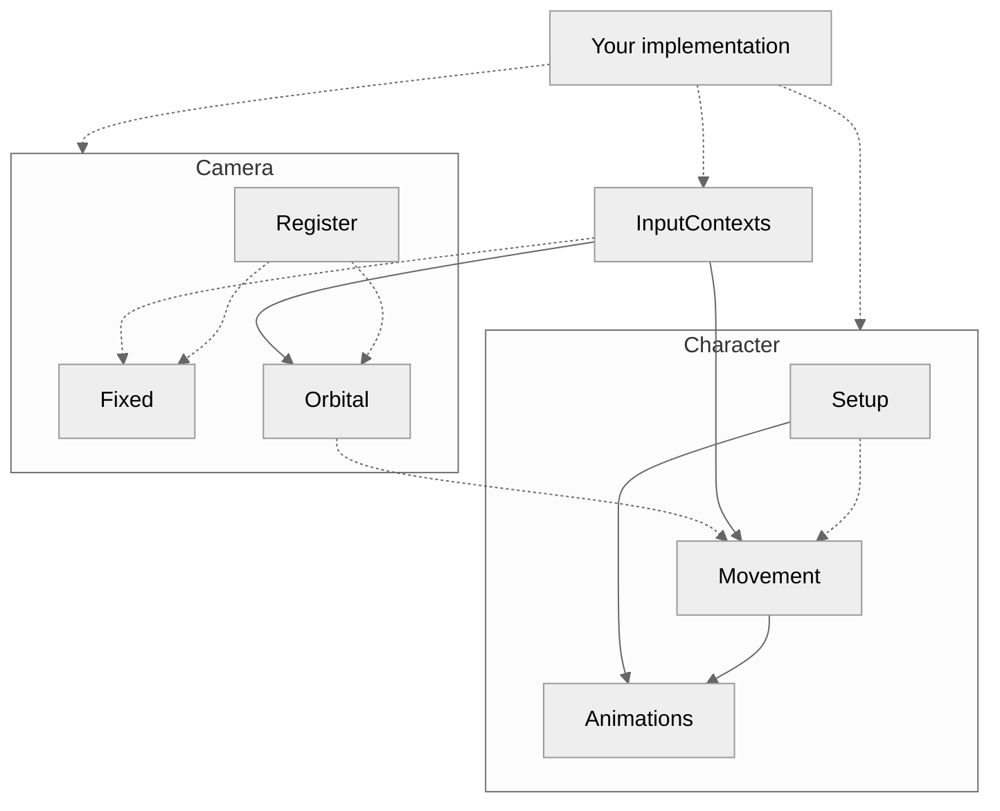

###### Dotted = optional; solid = required



To fully implement, all you need is:
- [workspace.AuthorityMode = Enum.AuthorityMode.Server](https://tenebrisnoctua.github.io/ServerAuthority/)
- the following on *both* RunContexts:
```luau
const controller = game:GetService("ReplicatedFirst").controller
```
- the following on a *Server* RunContext:
```luau
const CreateInputContexts = require(controller.InputContexts)(true)
const Movement = require(controller.Movement)(true)

game:GetService("Players").PlayerAdded:Connect(function(Player: Player): ()
  CreateInputContexts(Player)
  Movement(Player)
end)
```
> [!IMPORTANT]
> Call the factories once, outside `PlayerAdded` — calling `(true)` per player
> rebuilds the layout every time

- the following on a *Client* RunContext:
```luau
require(controller.InputContexts)(false)
require(controller.Character)(false)

const SetAnimation = require(controller.Animations)(false)
SetAnimation(YourAnimationOrKeyframeSequenceProvider)

const CameraModule = controller.Camera
const Types = require(CameraModule.Types)
const Camera = require(CameraModule) :: Types.Registry

Camera.Register(1, require(CameraModule.Fixed))
Camera.Register(2, require(CameraModule.Orbital))
Camera.Setup(2)
```
`SetAnimation` reloads the track each time it is called, so pass a new
`Animation` or `KeyframeSequenceProvider` to swap animations at runtime